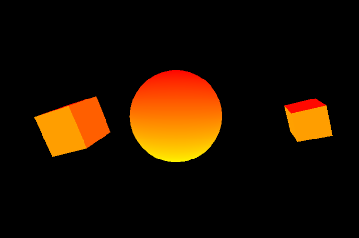

## Notas

Se recomienda usar la cantidad mínima requerida de luces
pues estas pueden impactar el rendimiento

## Luz Ambiente

Afecta todos los materiales. El color de la caja era blanco pero se ve del mismo color de la luz ambiente verde claro -> (#cfeeab)

## Luz Direccional (Como el sol)

Luz que viene de una dirección. La propiedad `position` indica el vector de donde proviene la luz.

En el ejemplo el color de la luz es magenta. La intensidad es de 0.3

La dirección se declara como un nodo hijo.

```html
<a-entity light="type: directional; color: magenta; intensity:0.3"  target="#direccionLuz" position="1 10 0">
    <a-entity id="direccionLuz" position="0 0 -1"></a-entity>
</a-entity>
```

## Luz Hemisferio.


Este tipo de luz permite asignar 2 colores:

1) Luz de la parte de arriba (atributo color)
2) Luz proveniente del piso (atributo groundColor)

Funciona como una luz ambiente. En el ejemplo se puede ver como
la parte inferior de la esfera se ilumina con el valor en 'groundColor'
y la parte superior con el valor de 'color'

```html
 <a-entity light="type: hemisphere; color: red; groundColor: yellow; intensity: 1" position="0 10 0"></a-entity>
 ```

